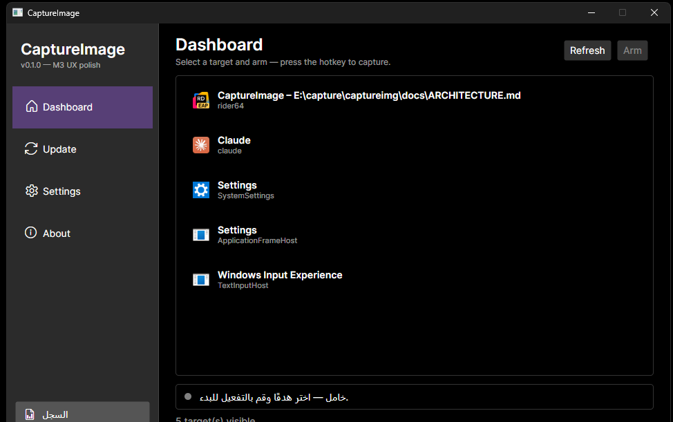
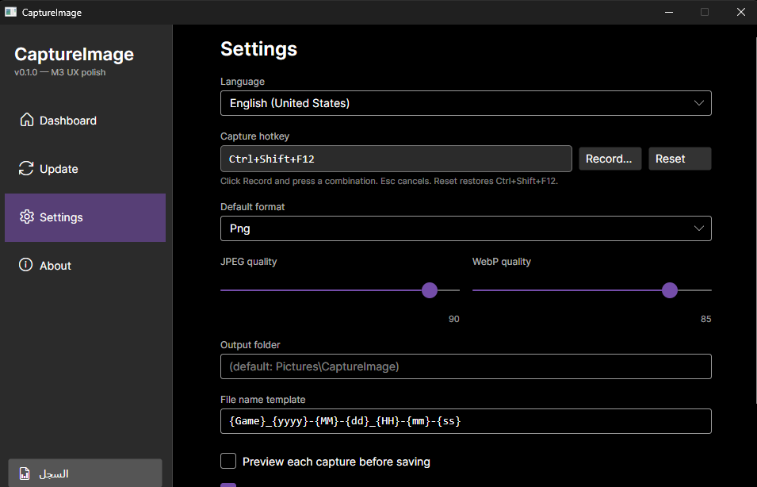
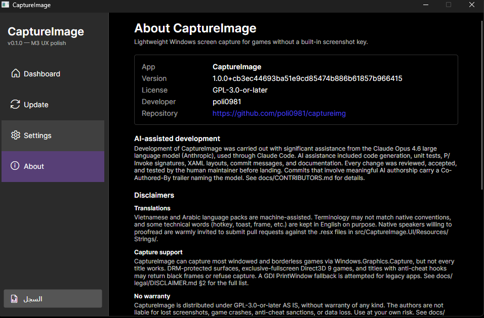
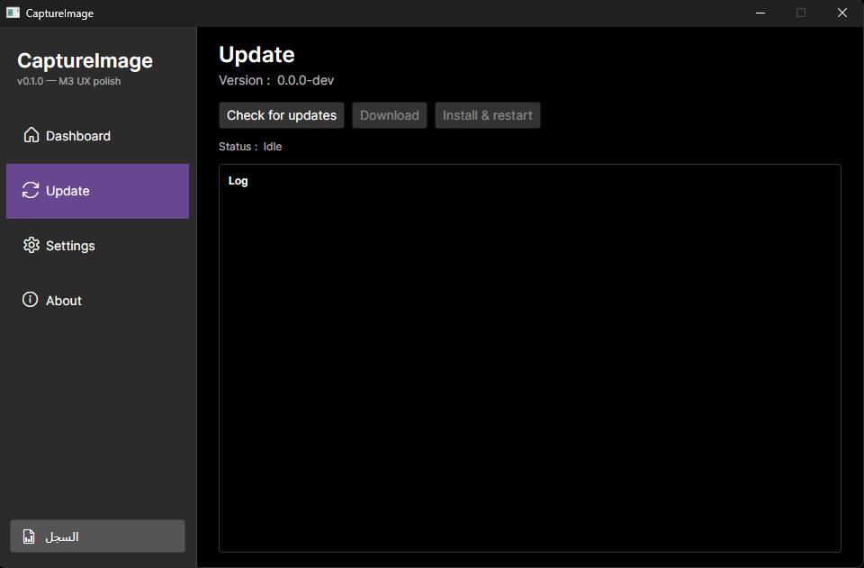
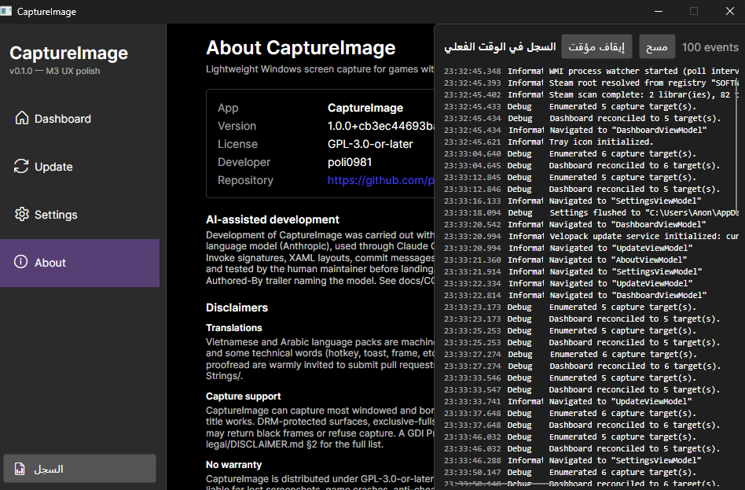
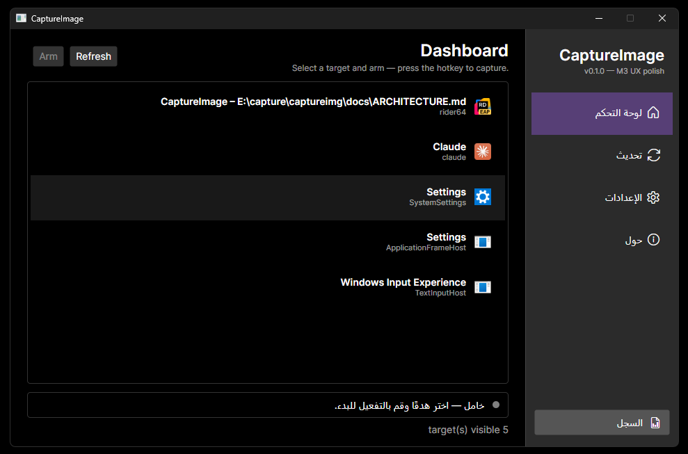

# CaptureImage

[](https://github.com/poli0981/captureimg/actions/workflows/ci.yml)
[](https://github.com/poli0981/captureimg/releases)
[](LICENSE)
[](https://dotnet.microsoft.com/en-us/download/dotnet/9.0)

A lightweight Windows screen-capture tool for games that don't ship a
built-in screenshot feature. Tray-resident, hotkey-driven, fast, and
gentle on resources.

> **One-line pitch:** pick a target window from a list, press
> `Ctrl+Shift+F12`, and your PNG lands in `Pictures\CaptureImage\`. That's it.

## Why

Many games — especially older ones, smaller indie titles, emulators,
and anything outside Steam — don't bundle a screenshot key. The Windows
built-in options (Snipping Tool, Xbox Game Bar, `Print Screen`) either
don't work on fullscreen DirectX surfaces or require interrupting your
session. The heavy alternatives (OBS, ShareX) are overkill when all you
want is _one frame of a specific window, now, into a file_.

CaptureImage fills that gap. It uses the same `Windows.Graphics.Capture`
API that OBS Studio uses for its Game Capture source, ships as a small
tray app, and stays out of your way until you press the hotkey.

## Features

- **Windows.Graphics.Capture** engine — hardware-accelerated, works with
  DX11/DX12/Vulkan windowed and borderless titles, same API OBS uses.
- **PrintWindow fallback** for legacy windowed apps that WGC refuses.
- **Live Dashboard** — every visible top-level window with an icon and
  title, refreshed in real time via WMI process events.
- **Steam warning badge** — if a capture target lives under a Steam
  library, a small badge reminds you that F12 screenshots are available
  via the Steam Overlay, and that some anti-cheat titles may block
  external capture.
- **Arm + global hotkey** — default `Ctrl+Shift+F12`, rebind in Settings
  (full hotkey editor is M6+).
- **Preview gate** — optional; show each capture, click Save or Discard.
- **4 output formats** — PNG, JPEG, WebP, TIFF, with per-format quality.
- **Local, private by default** — no telemetry, no cloud, no account.
  Update check is the only network call, and only when you click the
  button. See [`docs/legal/PRIVACY.md`](docs/legal/PRIVACY.md).
- **Tray icon + minimize-to-tray**, runtime-generated so no binary
  asset to ship yet.
- **Toasts, preview dialog, real-time log drawer** in the UI.
- **Localized** — English, Vietnamese, Arabic (with live RTL mirroring).
  Translations are machine-assisted — see
  [`docs/legal/DISCLAIMER.md §4`](docs/legal/DISCLAIMER.md).
- **Velopack auto-update** from GitHub Releases. Security policy below.

## Screenshots

Captured with CaptureImage itself — yes, we eat our own dog food.

| Dashboard | Settings | About |
|:-:|:-:|:-:|
|  |  |  |

| Update | Log viewer | RTL (Arabic) |
|:-:|:-:|:-:|
|  |  |  |

## Requirements

- **Windows 11 22H2 or later** (build 10.0.22621+). Required by the
  `Windows.Graphics.Capture` API. Older Windows 10 builds will not run.
- For the Steam badge to appear: Steam installed with at least one
  library. Otherwise the badge is simply absent.

## Install

Download `Setup.exe` from the
[latest GitHub Release](https://github.com/poli0981/captureimg/releases).
Velopack installs the app into `%LocalAppData%\CaptureImage\` — no admin
prompt, no registry spam, no background service.

### Unsigned installer — SmartScreen warning

**Heads-up:** CaptureImage is not yet code-signed (see
[`docs/legal/DISCLAIMER.md §7`](docs/legal/DISCLAIMER.md)). On first run
Windows SmartScreen will show:

> Windows protected your PC · Unknown publisher · Don't run

To proceed, click **More info** → **Run anyway**. If you want to verify
the download is unmodified, the release page includes `SHA256SUMS.txt`:

```powershell
Get-FileHash -Algorithm SHA256 .\Setup.exe
# Compare the output with the entry in SHA256SUMS.txt on the release page.
```

## Usage

1. Launch CaptureImage — a 960×600 window opens.
2. The **Dashboard** shows every visible top-level window on your desktop
   with its icon, title, and — for Steam games — a warning badge.
3. Click the target you want to capture.
4. Click **Arm**. The global hotkey listener starts.
5. Alt-Tab to the target, press **`Ctrl+Shift+F12`**.
6. If preview is enabled (Settings → Preview before save), a dialog
   shows the captured frame. Click Save or Discard.
7. The PNG (or JPEG/WebP/TIFF, your choice) lands in
   `%USERPROFILE%\Pictures\CaptureImage\` with a time-stamped filename.
8. A toast appears bottom-right confirming the save.

Close-to-tray is on by default — click the X, the window hides, the
tray icon stays. Quit via the tray menu's Exit item.

## Build from source

```bash
git clone https://github.com/poli0981/captureimg.git
cd captureimg
dotnet restore
dotnet build CaptureImage.sln -c Release
dotnet test CaptureImage.sln -c Release
dotnet run --project src/CaptureImage.App -c Release
```

The build needs:

- **.NET 9 SDK** — the repo's `global.json` pins the exact version.
- **Windows 10.0.22621 SDK** (or newer) for the WinRT projections the
  capture engine uses. Install via the Visual Studio Installer
  ("Windows 11 SDK (10.0.22621.x)") or directly from
  <https://developer.microsoft.com/en-us/windows/downloads/windows-sdk/>.

## Repository layout

```
src/
  CaptureImage.Core            Pure domain (models, abstractions, state machine,
                               pipeline). Portable net9.0, no Windows ties.
  CaptureImage.Infrastructure  Windows implementations: capture engine, process
                               watcher, Steam detector, hotkeys, settings, logging,
                               Velopack updater. net9.0-windows10.0.22621.0.
  CaptureImage.ViewModels      MVVM layer — reusable across UI frameworks, no
                               Avalonia references.
  CaptureImage.UI              Avalonia views, custom controls (ToastHost, etc.),
                               converters, resx localization.
  CaptureImage.App             Entry point, DI composition root, Serilog setup,
                               Velopack startup hook.
tests/
  CaptureImage.Core.Tests           xUnit — 31 tests (state machine, file name
                                    strategy, image format).
  CaptureImage.Infrastructure.Tests xUnit — 37 tests (VDF parser, Steam scanner,
                                    settings store, WGC integration).
  CaptureImage.ViewModels.Tests     Placeholder project for future VM tests.
docs/
  CONTRIBUTORS.md              Contributor list + AI-assistance policy.
  RELEASING.md                 How to cut a release.
  legal/
    DISCLAIMER.md              No-warranty, capture limits, AI-dev, translations.
    PRIVACY.md                 What's read, what's written, what's on the network.
    TERMS.md                   Plain-language restatement of GPL-3.0 obligations.
    THIRD_PARTY_NOTICES.md     Full dependency list + licenses.
```

## Architecture

See [`docs/ARCHITECTURE.md`](docs/ARCHITECTURE.md) for a one-page-per-layer
tour — layer rules, state-machine diagram, WGC capture pipeline sequence,
DI composition sketch, i18n + RTL flow, and Velopack update flow (all with
Mermaid diagrams rendered inline on GitHub).

## Contributing

See [`docs/CONTRIBUTORS.md`](docs/CONTRIBUTORS.md) for the full
contribution flow. The short version:

1. Open an issue first for anything non-trivial.
2. Follow conventional-commits style (`feat(...)`, `fix(...)`, `docs(...)`).
3. Run `dotnet build` and `dotnet test` locally before opening the PR.
4. Disclose AI-assisted changes in the PR description (not required, but
   helpful for reviewers).

**Translation help wanted.** The Vietnamese and Arabic language packs
are machine-assisted — native speakers who can proofread the `.resx`
files are warmly welcomed.

## Security

Report vulnerabilities privately via
[GitHub Security Advisories](https://github.com/poli0981/captureimg/security/advisories/new).
See [`SECURITY.md`](SECURITY.md) for the full policy, scope, and
response-time expectations.

## AI assistance

CaptureImage was developed with significant assistance from the
**Claude Opus 4.6** large language model, used through Claude Code,
during the 2026 development cycle. Every change was reviewed, accepted,
and tested by the human maintainer before landing. Commits with
meaningful AI authorship carry a `Co-Authored-By` trailer naming the
model. Full details in [`docs/CONTRIBUTORS.md`](docs/CONTRIBUTORS.md)
and [`docs/legal/DISCLAIMER.md §3`](docs/legal/DISCLAIMER.md).

## License

CaptureImage is distributed under the **GNU General Public License
v3.0 or later** (SPDX: `GPL-3.0-or-later`). See
[`LICENSE`](LICENSE) for the full text and
[`docs/legal/THIRD_PARTY_NOTICES.md`](docs/legal/THIRD_PARTY_NOTICES.md)
for attributions.
