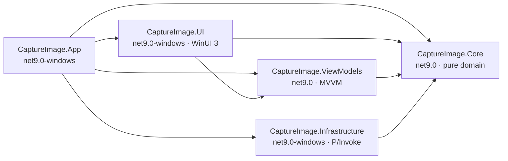
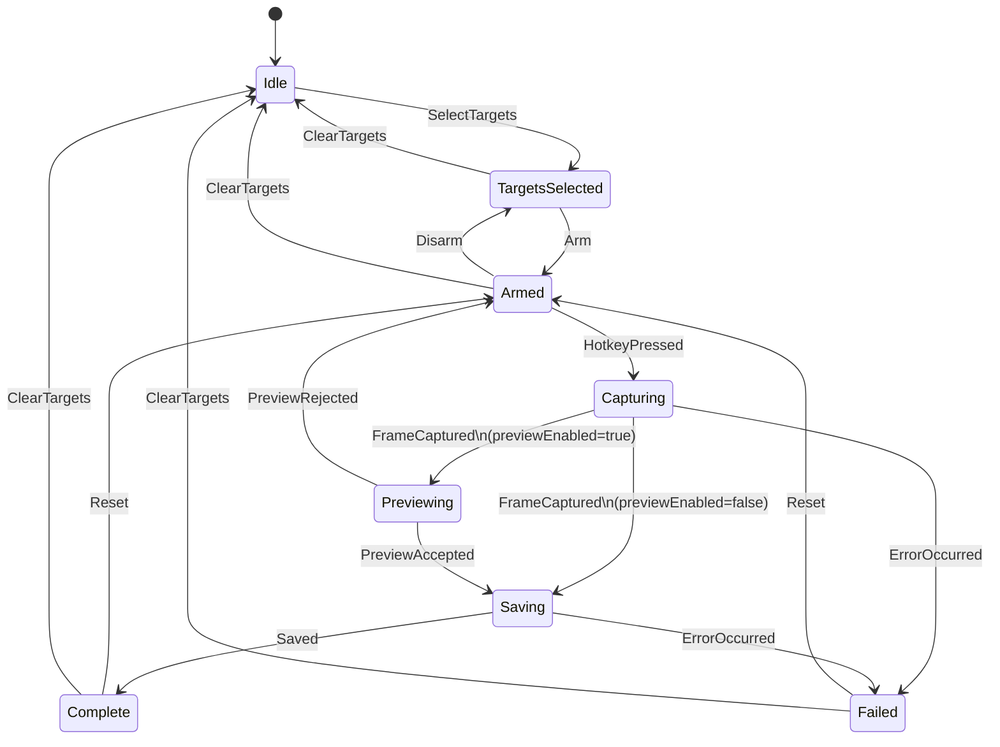
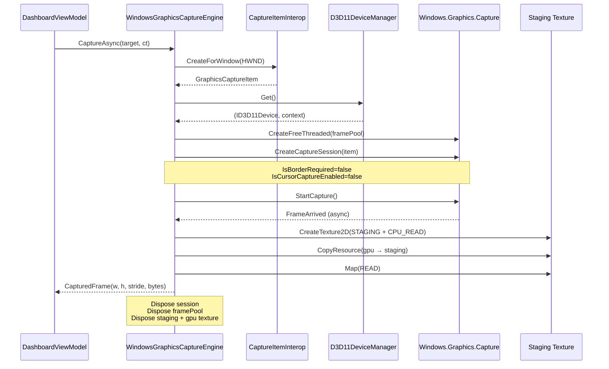
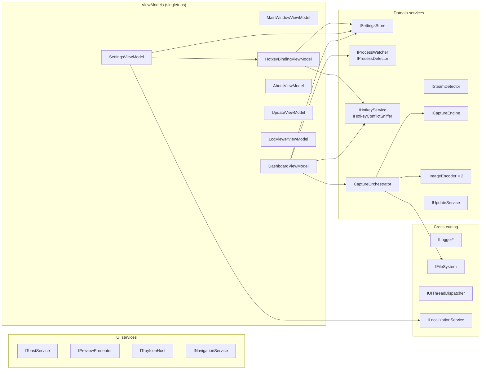
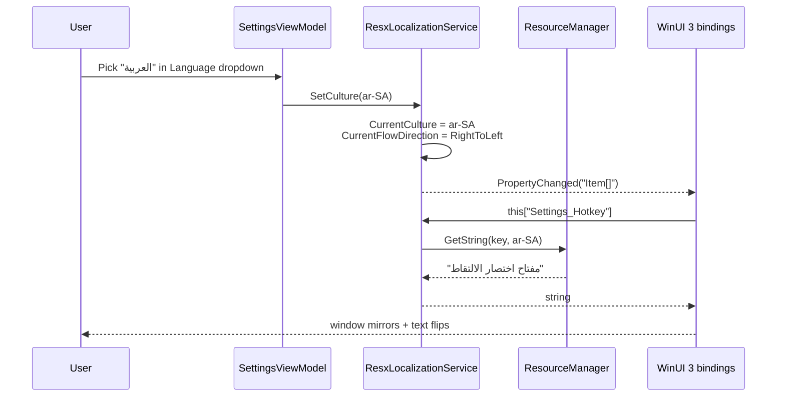
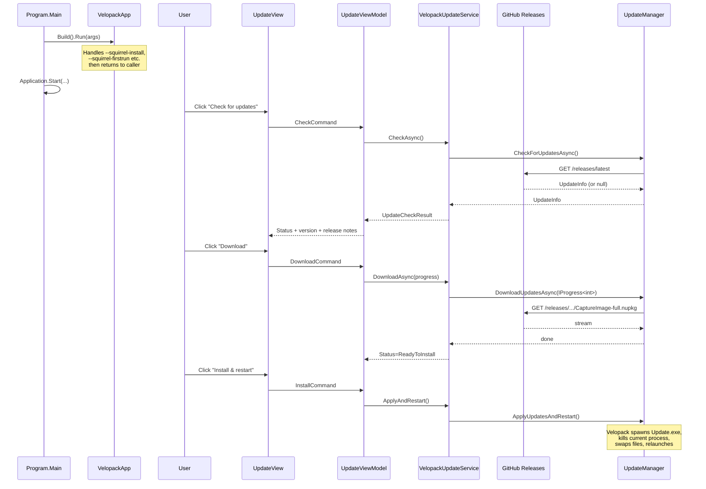

# Architecture

This document is a one-page-per-layer tour of CaptureImage for people who
want to contribute, audit, or port the code. It is **not** the design
intent record — that lives in the per-milestone plan files under
`.claude/plans/`. This is the shape of the code as it stands on `main`.

Diagrams are Mermaid so GitHub renders them inline. Source paths are
clickable; line numbers drift, so I link to files rather than lines.

## 1. Layer rules

Five projects, four rules:

- **`CaptureImage.Core`** (net9.0) — pure domain. Models, abstractions,
  state machine, pipeline. No platform references. **Depends on nothing.**
- **`CaptureImage.Infrastructure`** (net9.0-windows10.0.22621.0) — every
  Windows-specific implementation: WGC capture, D3D11 interop, WMI
  process watch, `RegisterHotKey` sniff, Velopack updater, Serilog sinks,
  JSON settings. **Depends on Core.**
- **`CaptureImage.ViewModels`** (net9.0) — MVVM layer using
  CommunityToolkit.Mvvm source generators. Platform-agnostic — these
  types exist so the UI logic is testable without WinUI 3.
  **Depends on Core only.**
- **`CaptureImage.UI`** (net9.0-windows10.0.22621.0) — WinUI 3 Pages +
  UserControls, converters, resx localization, tray host, picker COM
  interop. **Depends on Core + ViewModels.**
- **`CaptureImage.App`** (net9.0-windows10.0.22621.0) — the composition
  root. `Program.cs` + [`CompositionRoot.cs`](../src/CaptureImage.App/CompositionRoot.cs).
  Single point of DI wiring. **Depends on all four projects.**

**Why this shape:**

- `Core` stays portable so the domain logic is trivially testable. The
  Core test project runs on plain `net9.0`, no Windows 11 SDK needed.
- `ViewModels` stays off `net9.0-windows` so the type system stays
  portable — VM tests run on plain `net9.0` without dragging in WinAppSDK
  or WinRT projections.
- `Infrastructure` is the only project that touches `Windows.*`. If a
  future milestone ports to another desktop platform, that's the project
  that gets replaced.

## 2. Capture state machine

Every screenshot flows through a single
[`CaptureStateMachine`](../src/CaptureImage.Core/StateMachine/CaptureStateMachine.cs)
backed by the `Stateless` library. `DashboardViewModel` fires triggers;
the machine decides whether the preview step is visited based on a
live-checked `Func<bool> previewEnabled`.

**Rules of the road:**

- Transitions are driven by explicit triggers, never by timers. The
  viewmodel is the only thing allowed to call `Fire`.
- `Capturing → Saving/Previewing` uses `PermitDynamic` so the preview
  toggle is consulted at transition time. Changing the toggle while
  armed affects the *next* capture, not any in-flight one.
- `Failed` and `Complete` both route back to `Armed` on `Reset` so the
  user can fire another shot without re-selecting a target.
- `StateChanged` fires on whatever thread drove the trigger.
  `DashboardViewModel` marshals to the UI thread before touching
  bindings.

Tests cover every legal transition and assert illegal ones throw —
[`CaptureStateMachineTests`](../tests/CaptureImage.Core.Tests/StateMachine/CaptureStateMachineTests.cs).

## 3. WGC capture pipeline

The primary engine is
[`WindowsGraphicsCaptureEngine`](../src/CaptureImage.Infrastructure/Capture/WindowsGraphicsCaptureEngine.cs),
an on-demand single-frame pipeline. It uses the same
`Windows.Graphics.Capture` API that OBS Studio uses for Game Capture.
Hardware-accelerated, works with DX11/DX12/Vulkan windowed and
borderless-fullscreen titles.

**Invariants:**

- Exactly one frame per call. The framepool is `numberOfBuffers: 1` and
  the session is disposed as soon as the first frame arrives.
- 2-second `FrameTimeout`. Games that never render (minimized, stalled)
  surface as `CaptureError.NoFrameArrived`.
- BGRA8 only — pixel format is pinned so the encoder layer doesn't need
  a format negotiation step. The Skia/ImageSharp wrappers accept BGRA
  directly.
- Win11 22H2+ only. That's the minimum OS for the
  `IsBorderRequired = false` flag to actually hide the yellow capture
  frame. Older builds still work but show the frame.

**Fallback path:** if WGC itself fails (legacy GDI-only apps, some
emulators), the orchestrator retries with
[`PrintWindowFallback`](../src/CaptureImage.Infrastructure/Capture/PrintWindowFallback.cs)
which calls `PrintWindow(hwnd, hdc, PW_RENDERFULLCONTENT)`. Slower,
subject to HDCP, but wide compatibility.

## 4. DI composition

[`CompositionRoot.BuildServices`](../src/CaptureImage.App/CompositionRoot.cs)
is the only place DI registrations live. No scanning, no convention, no
assembly-level attributes — everything the runtime sees is explicit in
one file.

**Lifetimes:** every service and every viewmodel is a singleton. There
is no request scope — the app is one long-running desktop process with
a single window. `validateScopes: true` is on so DI misuse fails loudly
at startup.

**Startup order:**

1. `VelopackApp.Build().Run()` — must be the first line of `Main` so
   Velopack can handle `--squirrel-install`, `--squirrel-firstrun`, etc.
   before WinUI 3 spins up.
2. Serilog configured (file sink + in-memory ring buffer for the log
   drawer).
3. `BuildServices(inMemorySink)` — container built.
4. `ISettingsStore.LoadAsync()` — settings file read before any VM that
   depends on them is resolved.
5. `Microsoft.UI.Xaml.Application.Start(...)` — installs a
   `DispatcherQueueSynchronizationContext` on the freshly-minted UI
   thread, then constructs the `App` instance which `OnLaunched` shows
   the main window.

## 5. i18n + RTL

Resources live as three sibling `.resx` files under
[`src/CaptureImage.UI/Resources/Strings/`](../src/CaptureImage.UI/Resources/Strings):
`Strings.resx` (en-US, neutral), `Strings.vi.resx`, `Strings.ar.resx`.
MSBuild compiles them to satellite assemblies at build time. No
Designer-generated wrapper — we use `ResourceManager` directly.

**Key properties:**

- `PropertyChanged("Item[]")` is the magic indexer-binding refresh
  signal. WinUI 3 picks it up reliably for direct `{Binding Localization[Key]}`
  paths; computed `XLabel` properties on each VM (the pattern adopted in
  v1.1.2 to work around an Avalonia compiled-binding quirk) carry forward
  for live culture switching.
- `MainWindow.xaml` binds `FlowDirection` on its root Grid to
  `Localization.CurrentFlowDirection` via `FlowDirectionConverter` (a
  static IValueConverter declared at App.xaml `Application.Resources`
  scope). Arabic, Hebrew, Farsi, Urdu — any two-letter language code in
  the RTL set — mirrors the whole tree.
- No app restart required. Every VM that stores localized text holds
  only the key, looks up via the indexer, and refreshes on the
  `PropertyChanged` broadcast.
- Translations for VI and AR are machine-assisted today — see
  [`docs/legal/DISCLAIMER.md §4`](legal/DISCLAIMER.md). Native-speaker
  review is the next milestone's ask.

## 6. Update flow (Velopack)

[`VelopackUpdateService`](../src/CaptureImage.Infrastructure/Update/VelopackUpdateService.cs)
wraps Velopack's `UpdateManager` pointed at the GitHub Releases source.
Everything is explicit — no background timer, no silent upgrades. The
user clicks **Check for updates**, optionally **Download**, optionally
**Install and restart**.

**Development-mode caveat:** when the app is launched via
`dotnet run` (not from a Velopack-installed location), `UpdateManager`
reports `IsInstalled = false` and the service returns
`UpdateStatus.Unavailable`. The update tab still renders, it just tells
you updates are disabled and why. Release builds installed via `Setup.exe`
have `IsInstalled = true` and the full flow works.

**Unsigned installer today.** Velopack can sign the installer if given a
cert; CaptureImage doesn't have one yet (SignPath application was
declined for v1.0). Users see Windows SmartScreen's "Unknown publisher"
warning on first run. Integrity is still verifiable via the
`SHA256SUMS.txt` published alongside every release.

---

## See also

- [`docs/RELEASING.md`](RELEASING.md) — how releases are cut and
  published.
- [`docs/CONTRIBUTORS.md`](CONTRIBUTORS.md) — contribution flow, AI
  assistance policy, translation hand-off.
- [`docs/legal/`](legal) — disclaimers, privacy, third-party notices.
- The `Co-Authored-By` commit trailers naming Claude Opus 4.7 — see
  the git log for per-milestone design notes that influenced this
  architecture.
